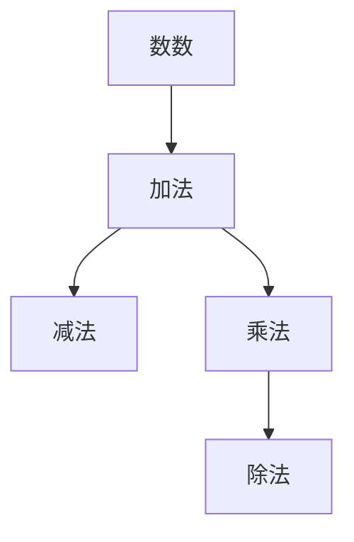

## 加法

一个加法算式可以用 $a+b$ 来表示，其中 $a$ 和 $b$ 都是自然数。

例如：

$$
5+8=？
$$

这个式子可以这样理解：我有 $5$ 个🍎，别人给我了 $8$ 个🍎，我一共有多少个🍎？

我们用数数的方法来算这道题。

先看第一个数，我有 $5$ 个🍎，也就是从 $5$ 开始。

再看第二个数，别人给我了 $8$ 个🍎。那么，再往后数 $8$ 个数，如下所示。

$$
6,7,8,9,10,11,12,13
$$

所以 $5+8=13$。

接下来我们想一个问题：**加数和加数调换位置，与原来的算式相不相等？即，$5+8$ 等不等于 $8+5$？**

现在我要算 $8+5$ 等于几。

从 $8$ 开始，一直往后数 $5$ 个数。

$$
9,10,11,12,13
$$

所以 $8+5=13$

**结论：两个加数调换位置，不会改变算式的和。**

## 减法

一个减法算式可以用 $a-b$ 来表示，其中 $a$ 和 $b$ 都是自然数。

例如：

$$
9-4=?
$$

接下来我要用加法来定义减法。

我们把它描述成一个加法问题，也就是：$4$ 加上几等于 $9$？

我们知道，

$$
4+\underline{~~ 5 ~~}=9
$$

所以 $9-4=5$

接下来我们想一个问题：**减数和被减数调换位置，与原来的算式相不相等？即，$9-4$ 等不等于 $4-9$？**

$9-4$ 是大的数减小的数，$4-9$ 是小的数减大的数。它们的结果肯定不一样。

**结论：被减数和减数调换位置，两个算式的差不相等。**

## 乘法

一个乘法算式可以用 $a\times b$ 来表示，其中 $a$ 和 $b$ 都是自然数。

例如：

$$
5\times 6=?
$$

接下来用加法来定义乘法。

我们把它描述成一个加法问题，也就是：$5$ 个 $6$ 相加等于几？

$$
6+6+6+6+6=30
$$

所以 $5\times 6=30$。

接下来我们想一个问题：**乘数和乘数调换位置，与原来的算式相不相等？即，$5\times 6$ 等不等于 $6\times 5$？**

现在算 $6\times 5$ 等于几。

$6$ 个 $5$ 相加等于几？
$$
5+5+5+5+5+5=30
$$

所以 $6\times 5=30$

**结论：两个乘数调换位置，不改变算式的积。**

## 除法

一个除法算式可以用 $a\div b$ 来表示，其中 $a$ 和 $b$ 都是自然数。

例如：

$$
8\div 4=？
$$

接下来我要用乘法来定义除法。

我们现在把他描述成一个乘法问题，也就是 $4$ 乘几等于 $8$？

$$
4\times \underline{~~ 2 ~~}=8
$$

所以 $8\div 4=2$

接下来我们想一个问题：**被除数和除数调换位置，与原来的算式相不相等？即，$8\div 4$ 等不等于 $4\div 8$？**

$8\div 4$ 是大的数除以小的数，$4\div 8$ 是小的数除以大的数。它们的结果肯定不一样。

**结论：被除数和除数调换位置，两个算式的商不相等。**

## 总结

除法和减法两个数字调换位置，两个算式的结果不相等。乘法和加法的两个数字调换位置，两个算式的结果都相等。

加法是通过数数来定义的，减法和乘法是用加法定义的，除法是用乘法定义的，如下图所示。

**数数是从什么开始定义的呢？**

这个问题留给聪明的你来回答吧！😎😎😎