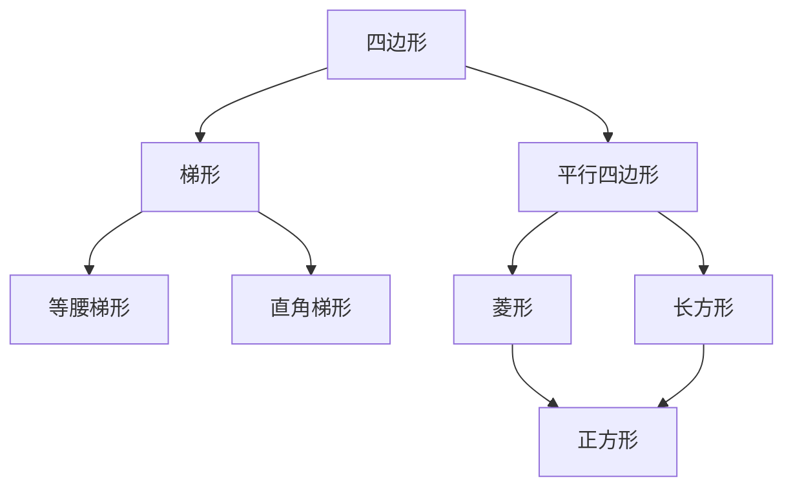

四边形在我们生活中很常见，比如，教室的黑板就是一个长方形。常见的四边形有梯形，平行四边形，等腰梯形，直角梯形，菱形，长方形，正方形等。这篇文章我主要讲这些四边形的定义和关系。

## 定义

**四边形**

定义

* 有四条边

* 是一个封闭的图形

* 两条边不能“交叉”

例子

 

 

如下我们一般认为它不是四边形

 

**平行四边形**

定义

* 四边形

* 对边长度相等

* 对边互相平行

例子

 

**梯形**

定义

* 四边形

* 只有一组对边平行

例子

 

**等腰梯形**

定义

* 梯形

* 两条腰的长度相等

例子

 

**直角梯形**

定义

* 梯形

* 有两个直角

例子

 

**菱形**

定义

* 四边形

* 四条边的长度都相等

例子

 

**长方形**

定义

* 四边形

* 邻边互为垂直

* 两组对边的长度相等

例子

 

**正方形**

定义

* 长方形

* 四条边都相等

例子

 

## 总结

我们把这些四边形的关系用一张图来表示。

